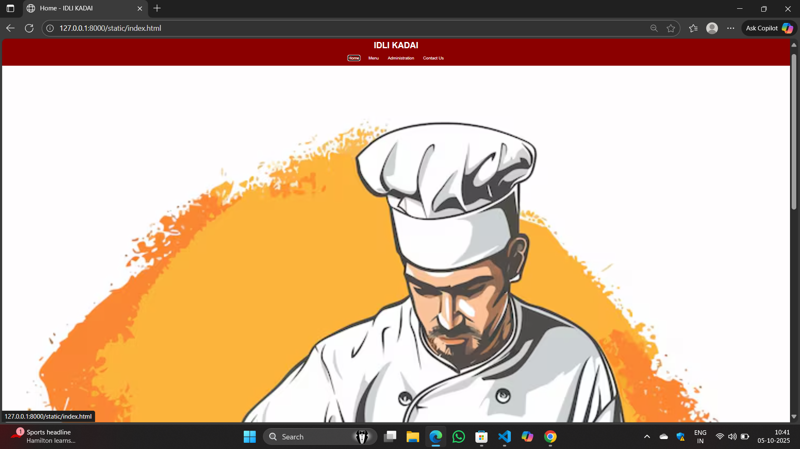
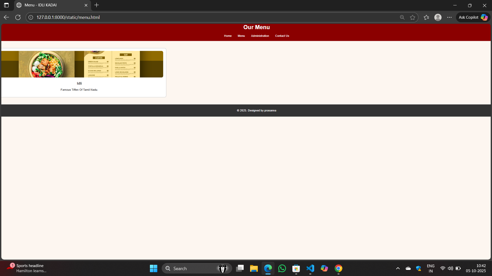
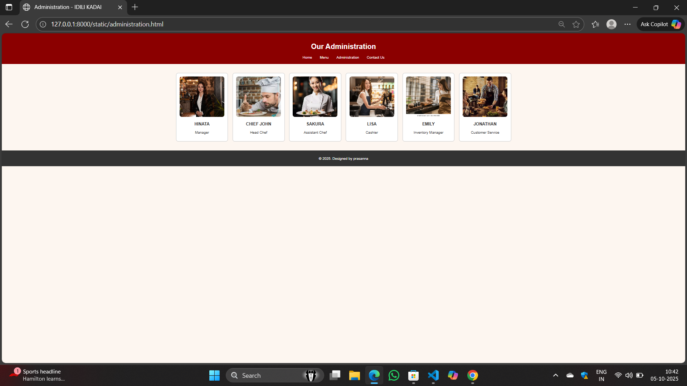
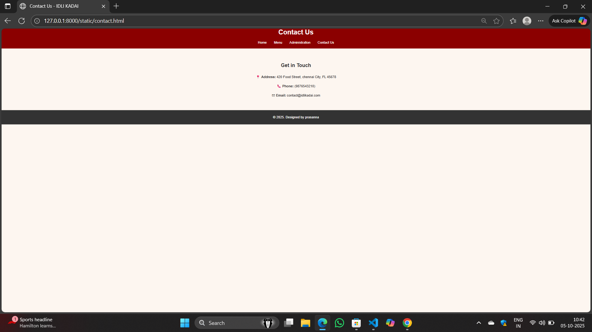

# Project Responsive Web Design using Bootstrap
## Date:15.10.2025

## AIM:
To create a simplified clone of Dribbble (https://dribbble.com/) landing page.


## DESIGN STEPS:

### Step 1:
Clone the repository from GitHub.

### Step 2:
Create Django Admin project.

### Step 3:
Create a New App under the Django Admin project.

### Step 4:
Insert the necessary CSS and JavaScript files as external in order to use Bootstrap.

### Step 5:
Create a HTML file and include the needed Bootstrap components.

### Step 6:
Publish the website in the LocalHost.

## PROGRAM :
```
static
index.html
!DOCTYPE html>
<html lang="en">
<head>
  <meta charset="UTF-8">
  <title>Home - IDLI KADAI</title>
  <link rel="stylesheet" href="style.css">
</head>
<body>
  <header>
    <h1>IDLI KADAI</h1>
    <nav>
      <a href="index.html">Home</a>
      <a href="menu.html">Menu</a>
      <a href="administration.html">Administration</a>
      <a href="contact.html">Contact Us</a>
    </nav>
  </header>

  <section class="banner">
    
  </section>

  <section class="content">
    <h2>Welcome!</h2>
    <p>Discover the best food in town, made with passion and fresh ingredients.</p>
  </section>

  <footer>
    <p>&copy; 2025. Designed by prasanna</p>
  </footer>
</body>
</html>

menu.html
<!DOCTYPE html>
<html lang="en">
<head>
  <meta charset="UTF-8">
  <title>Menu - IDLI KADAI</title>
  <link rel="stylesheet" href="style.css">
</head>
<body>
  <header>
    <h1>Our Menu</h1>
    <nav>
      <a href="index.html">Home</a>
      <a href="menu.html">Menu</a>
      <a href="administration.html">Administration</a>
      <a href="contact.html">Contact Us</a>
    </nav>
  </header>

  <section class="menu-grid">
    <!-- Repeat for 12 items -->
    <div class="menu-item">
      
      <h3>Idli</h3>
      <p>Famous Tiffen Of Tamil Nadu.</p>
    </div>
  </section>

  <footer>
    <p>&copy; 2025. Designed by prasanna</p>
  </footer>
</body>
</html>

administration.html
<!DOCTYPE html>
<html lang="en">
<head>
  <meta charset="UTF-8">
  <title>Administration - IDILI KADAI</title>
  <link rel="stylesheet" href="style.css">
</head>
<body>
  <header>
    <h1>Our Administration</h1>
    <nav>
      <a href="index.html">Home</a>
      <a href="menu.html">Menu</a>
      <a href="administration.html">Administration</a>
      <a href="contact.html">Contact Us</a>
    </nav>
  </header>

  <section class="admin-grid">
    <!-- Repeat for 6 people -->
    <div class="admin-card">
      
      <h3>HINATA</h3>
      <p>Manager</p>
    </div>
    <div class="admin-card">
      
      <h3>CHIEF JOHN</h3>
      <p>Head Chef</p>
    </div>
    <div class="admin-card">
      
      <h3>SAKURA</h3>
      <p>Assistant Chef</p>
    </div>
    <div class="admin-card">
      
      <h3>LISA</h3>
      <p>Cashier</p>
    </div>
    <div class="admin-card">
      
      <h3>EMILY</h3>
      <p>Inventory Manager</p>
    </div>
    <div class="admin-card">
      
      <h3>JONATHAN</h3>
      <p>Customer Service</p>
    </div>
  </section>

  <footer>
    <p>&copy; 2025. Designed by prasanna</p>
  </footer>
</body>
</html>

contact.html
<!DOCTYPE html>
<html lang="en">
<head>
  <meta charset="UTF-8">
  <title>Contact Us - IDLI KADAI</title>
  <link rel="stylesheet" href="style.css">
</head>
<body>

  <header>
    <h1>Contact Us</h1>
    <nav>
      <a href="index.html">Home</a>
      <a href="menu.html">Menu</a>
      <a href="administration.html">Administration</a>
      <a href="contact.html">Contact Us</a>
    </nav>
  </header>

  <section class="contact-info">
    <h2>Get in Touch</h2>
    <p>📍 <strong>Address:</strong> 420 Food Street, chennai City, FL 45678</p>
    <p>📞 <strong>Phone:</strong> (9876543210)</p>
    <p>✉ <strong>Email:</strong> contact@idlikadai.com</p>
  </section>

  <!-- Optional: Contact Form (if needed) -->
  <!--
  <section class="contact-form">
    <form>
      <label for="name">Name:</label><br>
      <input type="text" id="name" name="name"><br><br>

      <label for="email">Email:</label><br>
      <input type="email" id="email" name="email"><br><br>

      <label for="message">Message:</label><br>
      <textarea id="message" name="message" rows="5"></textarea><br><br>

      <button type="submit">Send Message</button>
    </form>
  </section>
  -->

  <footer>
    <p>&copy; 2025. Designed by prasanna</p>
  </footer>

</body>
</html>

```


## OUTPUT:




## RESULT:
The Project for responsive web design using Bootstrap is completed successfully.
